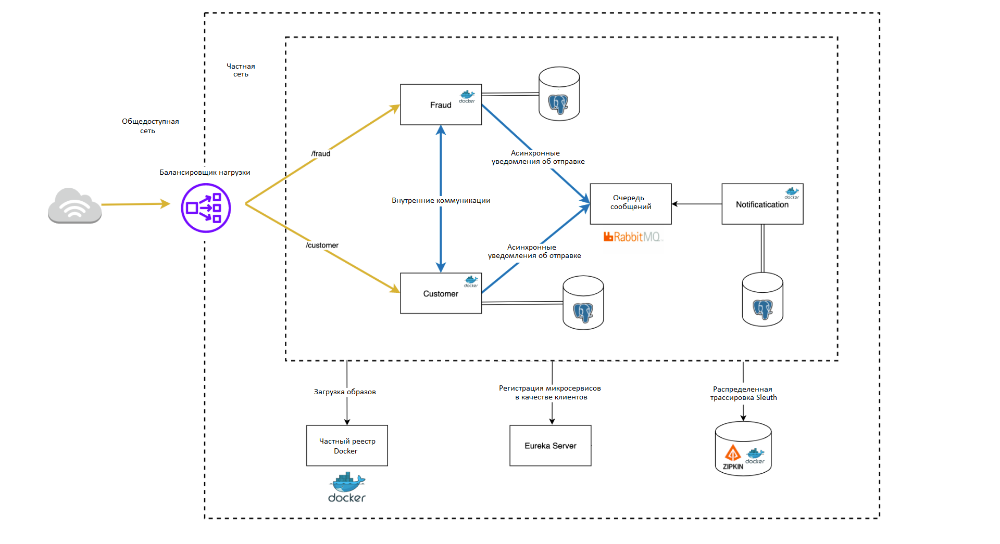

##Dimitriusservices

Этот простой микросервис проверяет запросы от клиента на предмет мошенничества.
Проект запускается посредством Docker. Настройки прописаны в файле `docker-compose.yml`.

####Схема взаимодействия сервисов проекта

